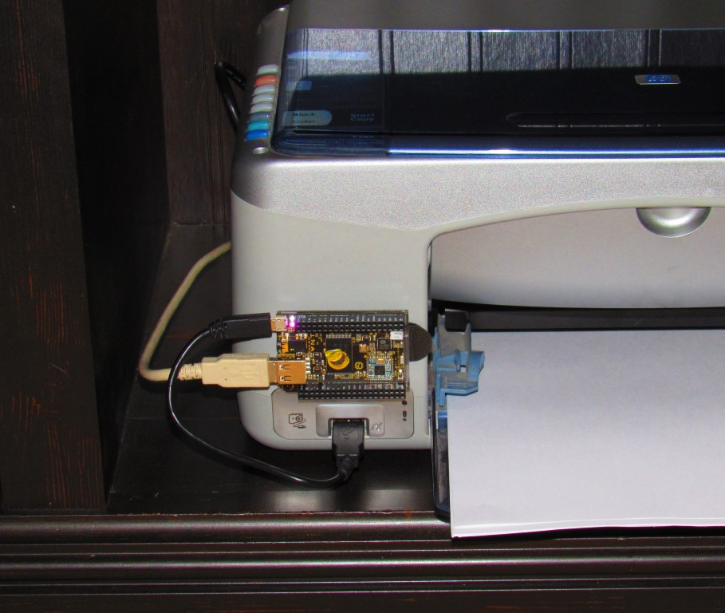

# Use a C.H.I.P. computer to convert an older USB printer to wifi.

C.H.I.P. is a cheap, single board computer with built in wifi, bluetooth, storage, and much more. Get yourself one from http://getchip.com/

### Connect C.H.I.P

My printer is an older HP PSC 1315xi All In One. It still prints fine, and I can still get ink for it, so it serves its purpose. 

I attached C.H.I.P to the printer using Command strips for fast, clean removal if needed. I am using the PictBridge USB port on the front of the printer to power C.H.I.P. The printer shows "E" and blinks a "!" but it still prints fine.



### Install CUPS and HP driver
I performed the install as the chip user. root works, too. The password is the same by default for both accounts.

```
sudo apt-get update
sudo apt-get install cups hplip
```

Configure CUPS similar to many of the Raspberry PI tutorials. For example: http://www.howtogeek.com/169679/how-to-add-a-printer-to-your-raspberry-pi-or-other-linux-computer/

Add the printer as a network printer to each computer that needs to print.

### Use Google Cloud Print to print from any Google account.

More info about the gcp connector: https://github.com/google/cups-connector/wiki/Install

I used the 'rpi-jessie' binary.

I also followed this guide (generally): https://github.com/google/cups-connector/wiki/Installing-on-Raspberry-Pi-Raspbian-Jessie

#### My exact steps:
```
sudo mkdir /usr/local/bin
sudo apt-get update
wget https://github.com/google/cups-connector/releases/download/2016.01.02/gcp-cups-connector-rpi-jessie-2016.01.02.tar.gz
tar -zxvf gcp-cups-connector-rpi-jessie-2016.01.02.tar.gz
sudo mv gcp-cups-connector/* /usr/local/bin
rm -f gcp-cups-connector
sudo mkdir /etc/gcp-cups-connector
/usr/local/bin/gcp-cups-connector-util init # This will get the printer setup with Google and create a config file. Follow the instructions.
sudo mv gcp-cups-connector.config.json /etc/gcp-cups-connector
```

Add this to the bottom of `/etc/rc.local` (before exit 0):
```
# Run the Google Cloud Print service as the chip user.
sleep 60
su --command "/usr/local/bin/gcp-cups-connector -config-filename /etc/gcp-cups-connector/gcp-cups-connector.config.json" chip > /tmp/gcp.log
```

If all goes well, you should see your printer in the Google Cloud Print manager. https://www.google.com/cloudprint?#printers